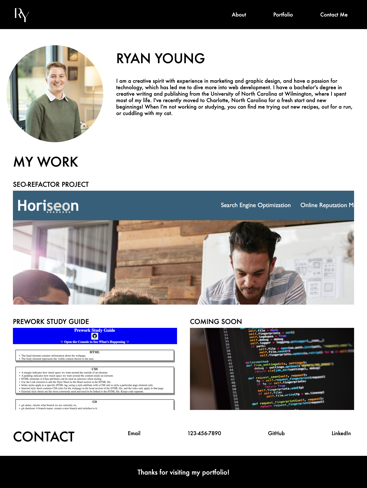

# Professional Portfolio

[Link to my project](https://ryan-young17.github.io/professional-portfolio/)

## Table of Contents
- [Description](#description)
- [Visuals](#visuals)

## Description
This web application is a mock-up of a professional portfolio to showcase who I am, the work I've done, and how to contact me. Using my skills in HTML and CSS, I created a webpage that displays sections containing information about me, along with a photo; examples of the work I have created thus far; and a few different ways to contact me.

## Visuals

